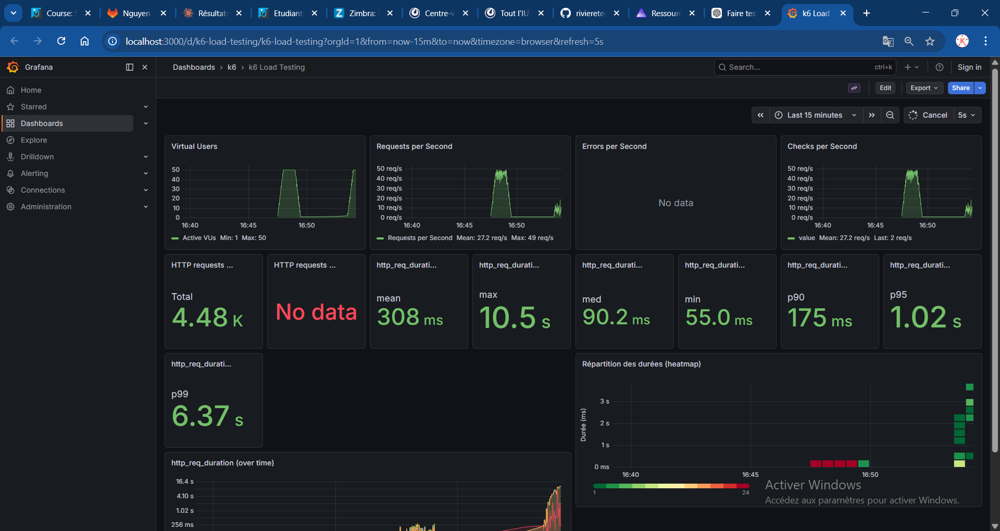

# Rapport — Load test 500k

**Test exécuté** : `task load-500k` (load test, 500 000 films)

## 1. Capture Grafana

_Collez ici une capture d’écran du dashboard Grafana (http://localhost:3000/d/k6-load-testing/k6-load-testing) pendant ou après l’exécution du test._

<!-- Remplacer par votre capture, ex. :  -->

## 2. Observations

_Décrivez ce que vous constatez lors de l’exécution du test (débit, latence, erreurs, comportement du système, etc.)._

- **Débit** : débit moyen de 27.2 req/s (pic à 49 req/s) pour 4 480 requêtes au total,
  soit un débit inférieur au test 50k (34.5 req/s) — le système ralentit sous la charge
  d'une base plus volumineuse.
- **Latence** : forte dégradation par rapport au 50k — la moyenne passe de 96.9 ms à
  308 ms, le p95 explose à 1.02 s et le p99 atteint 6.37 s, avec un max à 10.5 s.
  La médiane reste correcte à 90.2 ms mais la heatmap révèle des pics tardifs importants
  (requêtes montant jusqu'à 3-4 s en fin de test).
- **Erreurs** : aucune erreur HTTP enregistrée, mais la dégradation des percentiles élevés
  indique que le système commence à saturer sur 500k films — les requêtes les plus lentes
  suggèrent un manque d'index ou une pagination coûteuse sur de grands volumes.
