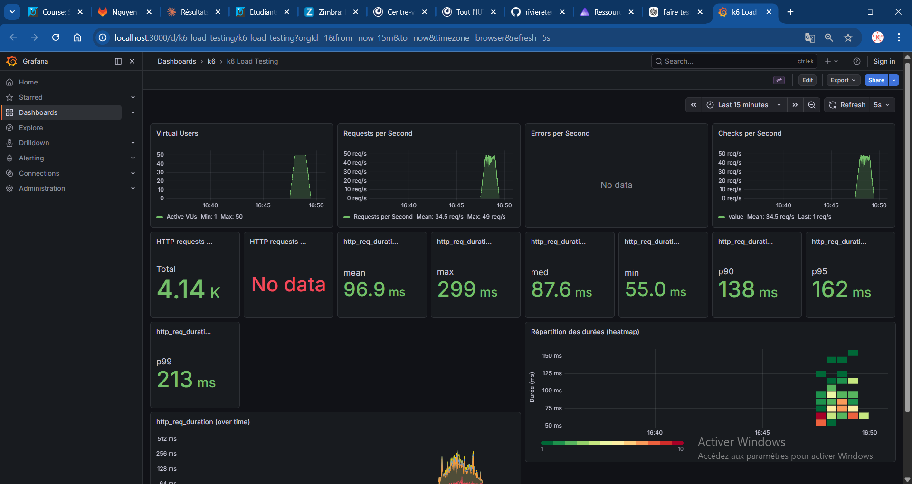

# Rapport — Load test 50k

**Test exécuté** : `task load-50k` (load test, 50 000 films)

## 1. Capture Grafana

_Collez ici une capture d’écran du dashboard Grafana (http://localhost:3000/d/k6-load-testing/k6-load-testing) pendant ou après l’exécution du test._

<!-- Remplacer par votre capture, ex. :  -->

## 2. Observations

_Décrivez ce que vous constatez lors de l’exécution du test (débit, latence, erreurs, comportement du système, etc.)._

- **Débit** : le système atteint un pic de ~49 req/s avec 50 VUs actifs, pour un débit moyen
  de 34.5 req/s sur l'ensemble du test (4 140 requêtes au total).
- **Latence** : les temps de réponse sont stables et corrects — moyenne 96.9 ms, médiane
  87.6 ms, p95 à 162 ms et p99 à 213 ms — bien en dessous des seuils acceptables.
- **Erreurs** : aucune erreur enregistrée (panneau "Errors per Second" vide), le système
  gère la charge sans dégradation ni échec sur 50 000 films.
