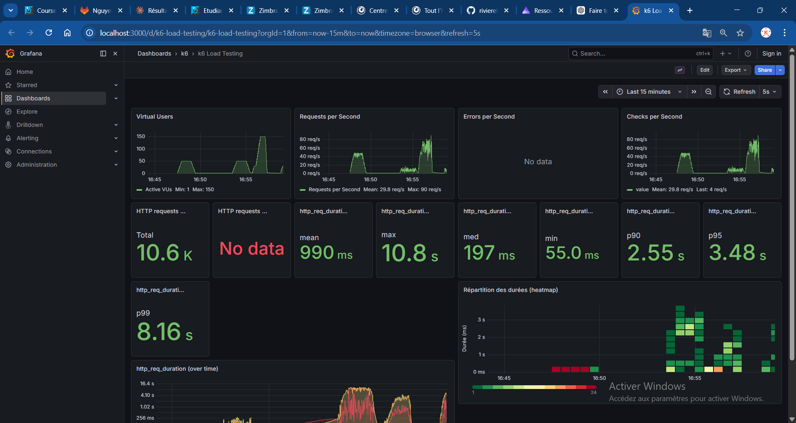

# Rapport — Spike test 500k

**Test exécuté** : `task spike-500k` (spike test, 500 000 films)

## 1. Capture Grafana

_Collez ici une capture d’écran du dashboard Grafana (http://localhost:3000/d/k6-load-testing/k6-load-testing) pendant ou après l’exécution du test._

<!-- Remplacer par votre capture, ex. :  -->

## 2. Observations

_Décrivez ce que vous constatez lors de l’exécution du test (pic de charge, latence, erreurs, dégradation, reprise, etc.)._

- **Pic de charge** : le test monte jusqu'à 150 VUs (3x plus que les autres tests) avec
  un pic à 90 req/s et une moyenne de 29.8 req/s pour 10 600 requêtes au total. Le graphe
  Virtual Users montre une montée brutale caractéristique du spike, suivie d'une descente
  rapide.
- **Latence** : dégradation critique — moyenne à 990 ms (quasi 1 s), médiane à 197 ms,
  p90 à 2.55 s, p95 à 3.48 s et p99 à 8.16 s avec un max à 10.8 s. La heatmap montre
  une large dispersion des durées entre 1 s et 3 s pendant toute la durée du pic,
  avec des requêtes extrêmes au-delà de 3 s — le système est clairement saturé.
- **Erreurs / reprise** : aucune erreur HTTP enregistrée malgré la saturation, mais c'est
  le test le plus sévère des quatre — la combinaison 500k films + 150 VUs en spike
  révèle les limites du système : la latence moyenne frôle 1 s et les queues s'accumulent,
  ce qui en production provoquerait des timeouts côté client.
