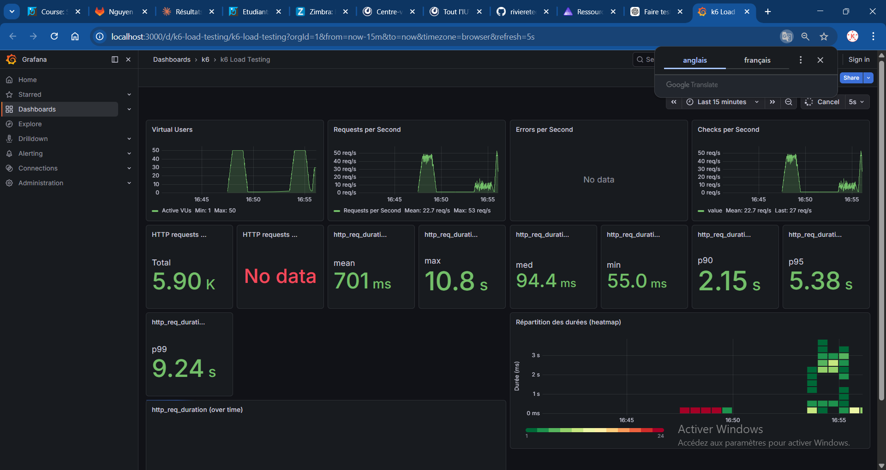

# Rapport — Spike test 50k

**Test exécuté** : `task spike-50k` (spike test, 50 000 films)

## 1. Capture Grafana

_Collez ici une capture d’écran du dashboard Grafana (http://localhost:3000/d/k6-load-testing/k6-load-testing) pendant ou après l’exécution du test._

<!-- Remplacer par votre capture, ex. :  -->

## 2. Observations

_Décrivez ce que vous constatez lors de l’exécution du test (pic de charge, latence, erreurs, dégradation, reprise, etc.)._

- **Pic de charge** : le test monte jusqu'à 50 VUs (pic visible sur le graphe Virtual Users)
  avec un max à 53 req/s, mais le débit moyen chute à 22.7 req/s — le système peine à
  absorber les montées brusques de charge comparé au load test progressif.
- **Latence** : dégradation sévère sous le spike — moyenne à 701 ms, p90 à 2.15 s,
  p95 à 5.38 s et p99 à 9.24 s avec un max à 10.8 s. La heatmap confirme une
  concentration des requêtes lentes (1-3 s) lors du pic, alors que la médiane reste à
  94.4 ms — signe que seule une partie des requêtes est fortement impactée.
- **Erreurs / reprise** : aucune erreur HTTP malgré la dégradation, mais les 5 900
  requêtes traitées et la dispersion extrême des latences montrent que le système ne
  gère pas bien les montées soudaines de charge, même sur 50k films.
